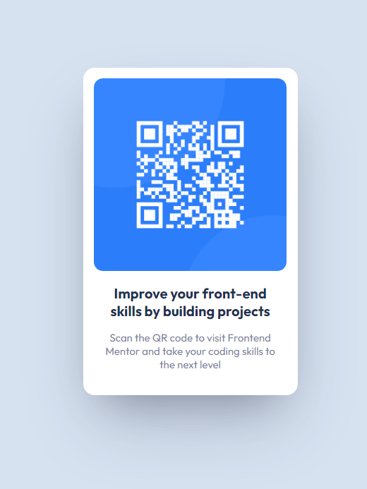

# Frontend Mentor - QR code component solution

This is a solution to the [QR code component challenge on Frontend Mentor](https://www.frontendmentor.io/challenges/qr-code-component-iux_sIO_H). Frontend Mentor challenges help you improve your coding skills by building realistic projects. 

## Table of contents

- [Overview](#overview)
  - [Screenshot](#screenshot)
  - [Links](#links)
- [My process](#my-process)
  - [Built with](#built-with)
  - [Useful resources](#useful-resources)
- [Author](#author)

## Overview

### Screenshot

### Links

- Live Site URL: [QR code component](https://sallis-gh.github.io/Frontend-Mentor-QR/)

## My process

### Built with

- Semantic HTML5 markup
- CSS custom properties
- Flexbox
- Mobile-first workflow

### Useful resources

- [Beautiful CSS box-shadow examples](https://getcssscan.com/css-box-shadow-examples) - Great place to get some quick and easy premade box-shadows.

## Author

- Frontend Mentor - [@Sallis](https://www.frontendmentor.io/profile/Sallis-GH)
- GitHub - [Sallis](https://github.com/Sallis-GH)

